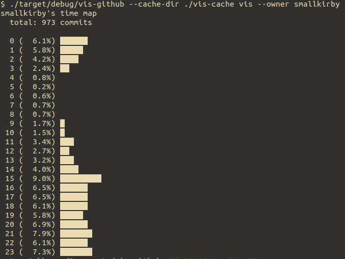

# vis-github

🚧🚧🚧🚧🚧🚧🚧🚧🚧🚧🚧🚧🚧🚧🚧🚧🚧🚧🚧




```.sh
cargo build
./target/debug/vis-github --cache-dir ./vis-cache --token "$GITHUB_API_TOKEN" fetch --owner <your name>
./target/debug/vis-github --cache-dir ./vis-cache vis --owner <your name>
```
