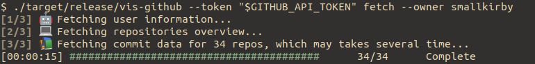
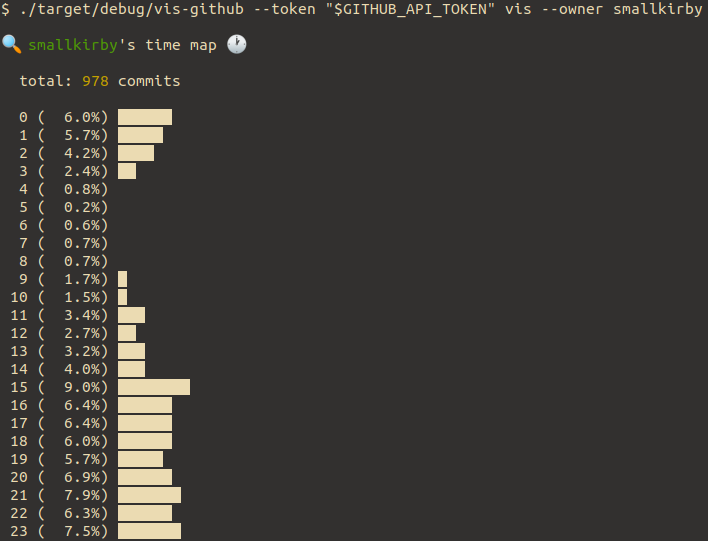
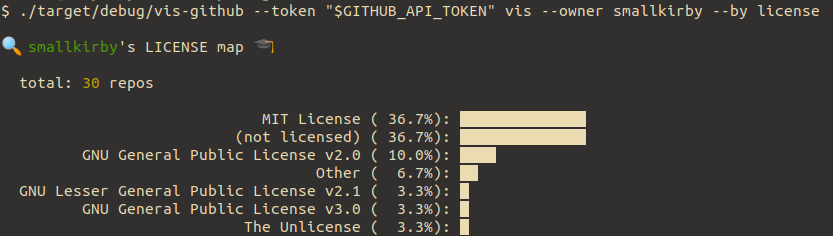
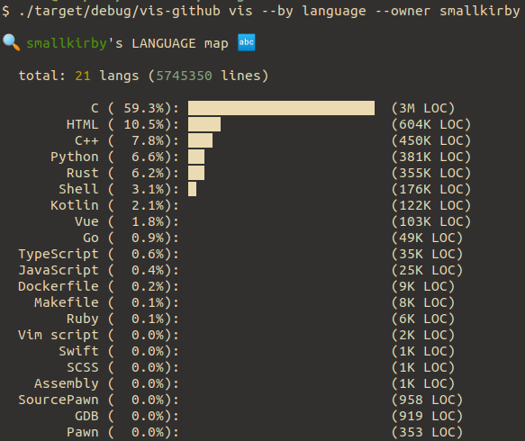

# vis-github






# About

`vis-github` is a simple Github statistics CLI visualizer.

# Build

```build.sh
git clone https://github.com/smallkirby/vis-github.git
cargo build
```

# Usage

```usage.txt
$ vis-github --help
vis-github 0.1.0
(c) 2021 smallkirby

USAGE:
    vis-github [OPTIONS] [SUBCOMMAND]

FLAGS:
    -h, --help       Prints help information
    -V, --version    Prints version information

OPTIONS:
    -C, --cache-dir <cache-dir>    Cache directory
    -t, --token <token>            Your API token of Github

SUBCOMMANDS:
    fetch    Fetch user and repos information for specified owner.
    help     Prints this message or the help of the given subcommand(s)
    rate     Show ratelimit for Github API
    vis      Visualize Github history.
```

# Note

- `vis-github` downloads repository and related information, which would consume your API rate limit. Be careful not to repeat data fetching too much if you have many repos.
